# The Price is Perfect
## *Airline Ticket Price Optimization*

### 1. Introduction
In this project, I'd like to introduce a dynamic programming approach to find the optimal pricing policy and the number of tickets to offer for sale given the following conditions about the flight.

* Flight is set to depart in *365* days
* 100 Coach seats and 20 First-Class seats are available for sale
* For coach seats, we can choose to sell the tickets at
    * $300 and expect the probability of a sale of 0.65 each day
    * $350 and expect the probability of a sale of 0.30 each day
* For first-class seats, we can choose to sell the tickets at
    * $425 and expect the probability of a sale of 0.08 each day
    * $500 and expect the probability of a sale of 0.04 each day
* *However, if all the first-class tickets are sold-out, the probability of a coach ticket sale increases by 3% (0.03)*
* If we overbook coach tickets, we have two possible resolutions for overbooked customers
    * Bump them to first-class for a cost of $50 incurred by the airline
    * Bump them off the plane for a cost of $425 incurred by the airline in terms of refund/rescheduling
* The discount rate is 17% per year
* On the day of the flight, we can expect
    * The probability of a coach ticket holder showing up as 0.95
    * The probability of a first-class ticket holder showing up as 0.97

Some simplifications are also assumed for this project
* The maximum demand for a ticket is only 1. In other words, we can either sell or not sell a single ticket each day
* The demand for coach and first-class tickets is independent, although, that might depend on the pricing policy of the airline

### 2. Approach

We introduce 2 approaches to solve the dynamic problem. First, we'll see what the optimal solution is when we put-up tickets for sale until we exhaust all of them without refusing to sell the ticket anytime a demand is made. In the second approach, we retain the right to block a ticket sale even when there are more tickets left to sell. We can then observe how the solution varies, and if the flexibility of refusing to sell a ticket is advantageous or disadvantageous.

#### 2.1 Low Flexibility Approach
We need to formulate the dynamic programming problem and define the state variables, decisions, dynamics, value function, Bellman equation, and terminal & boundary conditions.

##### 2.1.1 State Variables
State variables are the set of variables that are used to describe the possible "states" of the
dynamic system. In this problem, we will have three such variables, namely -
1. Number of seats sold in coach: `c`
2. Number of seats sold in first-class: `f`
3. Time (current day): `t`

##### 2.1.2 Decisions
We (the airline) have to decide the price to be set for the coach and first-class tickets on each day. Both classes have two possible prices we can set. Let us call these decisions $D_{FC}$ for the decision we make for the price of first-class tickets, and $D_{C}$ for the decision we make for the
price of the coach tickets. Therefore, we get four combinations of different decisions that can be
made on each day, they are -
1. Sell coach at **High** price, sell first-class at **High** price
2. Sell coach at **High** price, sell first-class at **Low** price
3. Sell coach at **Low** price, sell first-class at **High** price
4. Sell coach at **Low** price, sell first-class at **Low** price

##### 2.1.3 Dynamics
Based on the decisions made and the outcome of the customers buying/not-buying the tickets, we have the following dynamics where the state of the system can move from any state `(c, f, t)` to its corresponding possible future states
1. Sold a coach ticket, Sold a first-class ticket: `(c+1, f+1, t+1)`
2. Sold a coach ticket, No sale of first-class ticket: `(c+1, f, t+1)`
3. No sale of a coach ticket, Sold a first-class ticket: `(c, f+1, t+1)`
4. No sale of a coach ticket, No sale of first-class ticket: `(c, f, t+1)`

##### 2.1.4 Value function
We have the value function at any state of the system as the “value” (expected profit) generated by all the future decisions up to that particular state. The value of the value function (informal) at any given state can be formulated as follows -

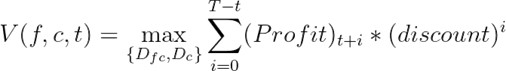

We are yet to calculate the values of the profit at any given time. However, this is what the value function aims to achieve. It is trying to make decisions DFC and DC such that the total profits from the future when considered as the present value is maximized

##### 2.1.5 Bellman Equation
We now consider the Bellman Equation, which formulates the value function in terms of the value function of a possible future state’s value function. Therefore, this helps us backtrack the value until the present day if we know the terminal values.

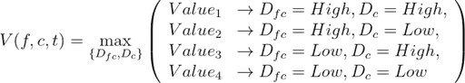

Therefore, we have four possible values at any given state out of which we choose the one that results in the largest value at the given state. These four values are calculated as follows -

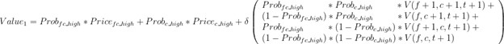
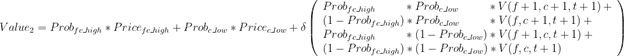
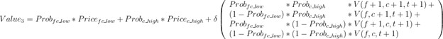
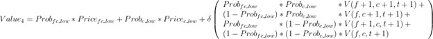

##### 2.1.6 Terminal and boundary conditions
The *boundary* conditions are when we sell out of either first-class, coach, or both the tickets. The value function as defined by the Bellman Equation above simplifies to contain only the terms for the tickets that are remaining.

**Boundary-1**: Let us consider the case of coach tickets being sold out $(c=Seats_C)$. The Bellman Equation consists of only two terms since we only have to make a decision for the first-class tickets.

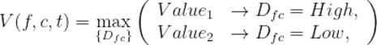

Here, the calculation for the values - 1 and 2 - is also simplified to the following:

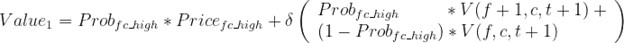
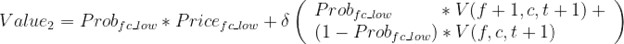

**Boundary-2**: When we consider the boundary where the first-class tickets are sold out $(fc=Seats_{FC})$, the math to calculate the value function in the form of Bellman Equation is similar to the calculation done above.

**Boundary-3**: When we consider the boundary where both the first-class and coach tickets are sold out, the value function is no more as complex as the previous cases. It simplifies to being just the discounted value of the next time period when the states remain the same as this time period.

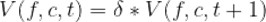

The **Terminal** condition is when we reach the day of the flight departure and we cannot sell any more tickets. Then, the value of a particular state is just the *expected cost* incurred if we bump the overbooked customers to first-class or off the plane. The following is the algorithm to determine the cost of each state at time t=T.

> **Algorithm to calculate the cost of a terminal state**
> 1. Loop through each possible pair of states for first-class and coach - `f` and `c`
> 2. For each `f`, `c`, Loop through each possible pair of people that can show up to the flight in both first-class and coach - `f’`, `c’`
> 3. Calculate the number of overbooked seats in coach `b = max(c’ - Seats_C , 0)`
>     * If `b` is 0, then the `cost(f’,c’)=0` (continue to next pair of `f’` and `c’`)
>     * Else, calculate the number of free seats available in first-class `a = Seats_FC- f`
> 4. Incur the cost of bumping up a customer to first-class by bumping up as many customers to first-class as possible. To do this,
>     * first calculate the number of people who can be bumped up
>     * `cost(f’,c’) += 50*min(a,b)`
> 5. For the remaining customers, `k=b-a`, calculate the cost of kicking the customers off the plane.
>     * `cost(f’,c’) += 425*k`
> 6. For each `(f’, c’)`, calculate the probability of `f’` out `f` and `c’` out of `c` people showing up for the flight. Therefore, the terminal value function `V(f, c, T)` can be calculated as: 
> 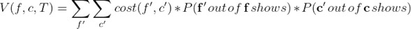

#### 2.2 High Flexibility Approach